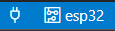

# Dual Core

This program shows how to create and run tasks on the 2 cores of the ESP32 development board.

# Hardware Required

1. A development board with ESP32/ESP32-S2/ESP32-S3/ESP32-C3 SoC (e.g., ESP32-DevKitC, ESP-WROVER-KIT, etc.)
2. A USB cable for Power supply and programming.
3. Optional circuit for an external LED.

# Software Required

1. ESP-IDF Windows Development Framework for ESP32 at https://dl.espressif.com/dl/esp-idf/ for Windows
2. Visual Studio Code extension: ESP-IDF Explorer at https://marketplace.visualstudio.com/items?itemName=espressif.esp-idf-extension

# How to run this code 

* Through the ESP-IDF terminal
  Steps:
    1. Go to the directory where the project is saved
    2. Before project configuration and build, be sure to set the correct chip target using `idf.py set-target Esp32`.
    3. Type in `idf.py build` to build the project
    4. Now flash it onto your board using the `idf.py -p (PORT) flash`. Make sure to select the correct PORT here.
    5. You can use the `idf.py monitor` command to display your program output on the monitor.
    6. You can also use the `idf.py -p PORT flash monitor` to flash and monitor at once.

* Through the ESP-IDF extension on Visual Studio Code
  Steps:
    1. Select and open your project folder.
    2. Select your PORT and target board by clicking on these .
    3. Now click on  to build the project.
    4. Click on  to select flash method. I have used UART.
    5. Click on  to flash it onto the board.
    6. You can click on  to display on monitor.
    7. Alternatively, you can use this  to build, flash and monitor all at once. 
    8. You can also open the ESP-IDF terminal using  and use the terminal commands to build and implement your project.

# Output

# Points to note

* To exit the serial monitor, type `Ctrl-]`.
* Make sure you enter the correct pin number based on whether you use an external or internal LED.
* Read the code comments to understand the purpose of every method used.
* You can refer to the [Getting Started Guide](https://docs.espressif.com/projects/esp-idf/en/latest/get-started/index.html) for full steps to configure and use ESP-IDF to build projects.
* You can refer to https://docs.espressif.com/projects/esp-idf/en/latest/esp32/api-guides/tools/idf-monitor.html for other IDF monitor commands. 
* For any queries, please open an [issue](https://github.com/Cher-B/ESP32/issues) on GitHub and I will try to get back to you soon.
